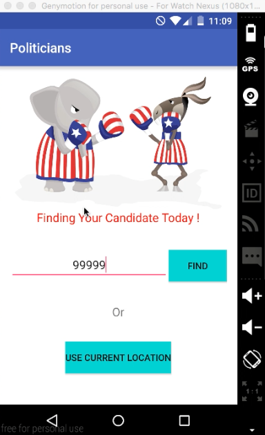

# PROG 02: Represent!

This is an application, Andriod and Andriod wear, finding your Senators and Representatives based on current location or zipcode. You can shake your wear to select random zip code in the US to see the politicans. It would display phone and wear at the same time.
  User can select a candidate on the wear and select learn more, to check detail on the phone.

## Authors

Ki Kouch ([ki.ey.kouch@berkeley.edu](mailto:your_email@berkeley.edu))

## Demo Video

See [Prog 02: Represent] (https://vimeo.com/157888517)

## Screenshots
Main screen for mobile, to perform either search by zipcode or current location. 

 Result after Shaking and visit email, website, and detail 

  Republican: display in blue color  

  2012 Electrion Result, Display on Wear  

## Acknowledgments
Catnip from CS160 Sample Project.
 Stackoverflow for Shaking Detection Android.

